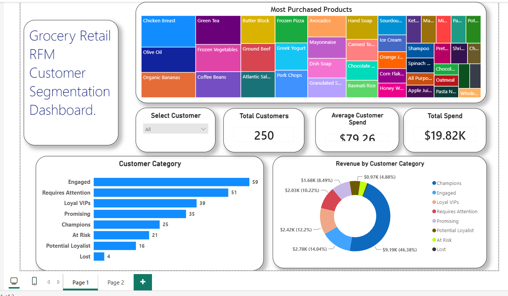

# Grocery Retail RFM Analysis

# Project Overview

  - This project focuses on RFM (Recency, Frequency, Monetary) Analysis to segment customers based on their purchasing behavior using six months of grocery retail     sales data (January 2025 – June 2025).
    
  - The raw sales data was processed in Google BigQuery, where SQL was used to combine monthly datasets, calculate RFM metrics, rank customers, and classify them      into meaningful customer segments. The final analytical dataset was then connected to Power BI to create an interactive dashboard that helps businesses            identify high-value customers, understand purchasing patterns, and support customer retention strategies.

# Tools Used
  - Google BigQuery – Data processing, SQL queries, and customer segmentation.
  - Power BI – Interactive dashboard creation and data visualization.
  - CSV Files – Source data containing six months of grocery retail transactions (January 2025 – June 2025).

# Business Problem

    For this project, I wanted to understand customer purchasing behavior using six months of grocery retail sales data. Instead of looking only at total sales, I     used RFM (Recency, Frequency, Monetary) Analysis to group customers based on how recently they purchased, how often they purchased, and how much they spent.
    
    The goal was to identify different customer segments such as Champions, Loyal VIPs, At Risk, and Lost customers. These insights can help businesses understand     their customer base better and support decisions related to customer retention and targeted marketing.
# Dataset
    The dataset contains grocery retail sales transactions from January 2025 to June 2025. Each month's data was stored in a separate CSV file and uploaded to         Google BigQuery for analysis.

Each transaction includes the following fields:

  - Order ID
  - Customer ID
  - Order Date
  - Product Type
  - Product Name
  - Order Price    

# SQL Workflow

The analysis was performed in Google BigQuery using SQL.

The workflow included:
  a) Combined six monthly CSV files into a single sales table using UNION ALL.
  b) Calculated Recency, Frequency, and Monetary (RFM) values for each customer.
  c) Used window functions such as DENSE_RANK() and NTILE() to rank customers.
  d) Segmented customers into categories like Champions, Loyal VIPs, Potential Loyalist, At Risk, and Lost.
  e) Identified the most purchased product for each customer.
  f) Created a final view by joining the customer segmentation and product information, which was then imported into Power BI.

# Dashboard Features

The Power BI dashboard provides insights into customer purchasing behavior and includes:

  - Overall sales and customer KPIs
  - Customer segmentation based on RFM analysis
  - Revenue contribution by customer segment
  - Top-performing products
  - Customer-wise purchase details
  - Interactive filters for exploring the data

# Key Insights

This dashboard helps answer business questions such as:

  - Which customers are the most valuable?
  - Which customers are at risk of churning?
  - Which customer segment contributes the most revenue?
  - Which products are purchased most frequently?
  - What is each customer's most purchased product?

By 
Siddhesh Gadadhare 

    
    
